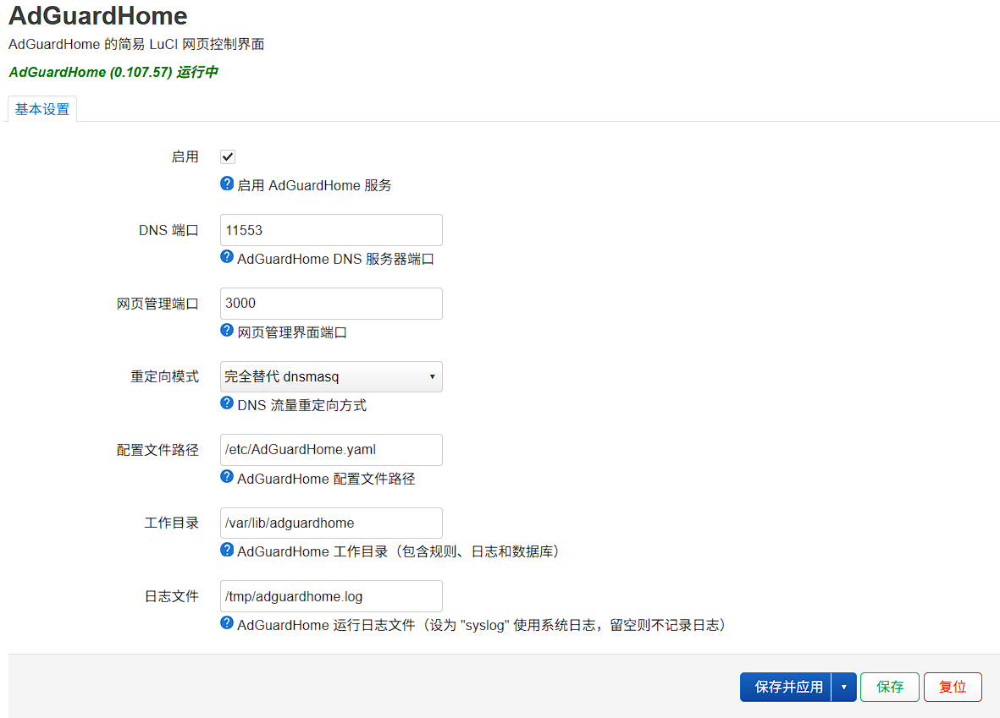

# luci-app-adguard

默认 Web 端口 `3000`

用户名: admin

密码: admin

修改密码：密码加密为 Bcrypt (Rounds: 10) 生成密码在 `AdGuardHome.yaml` 修改即可

如果替换无效，请检查是否有应用修改了 `dnsmasq` 的 `DNS端口`，如果没有请执行

```
uci set dhcp.@dnsmasq[0].port="53"
uci commit dhcp
```

继续尝试启用替换 `dnsmasq`

